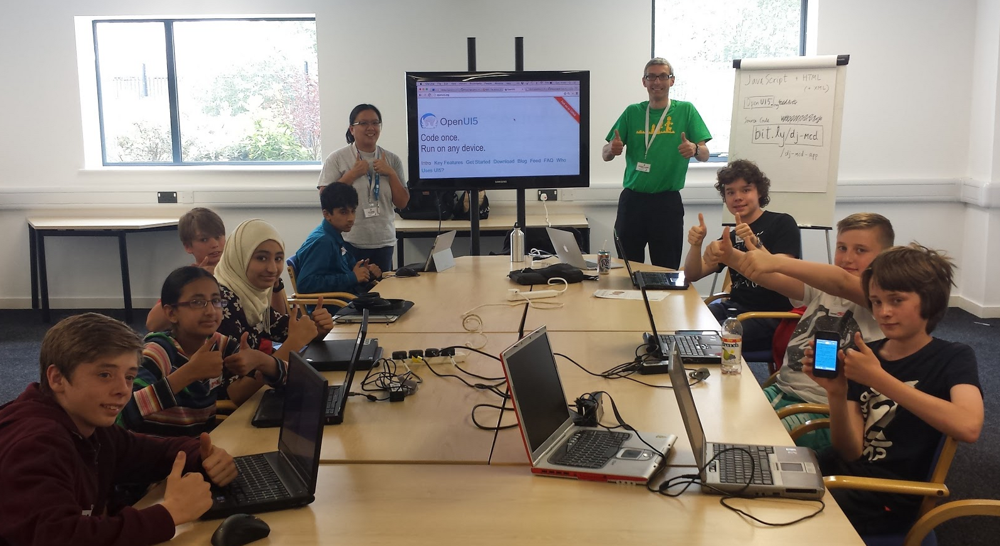
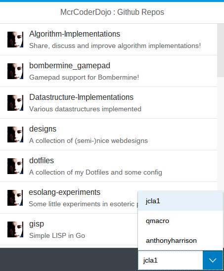

# mcrcoderdojo-openui5
A 5 Step Simple OpenUI5 App Example for Manchester CoderDojo

On Sun 12 July at [The Sharp Project](http://www.thesharpproject.co.uk/), we ran a
[Manchester CoderDojo](http://mcrcoderdojo.org.uk/) event. One of the workshops was on building a simple 
responsive app with the [OpenUI5 toolkit](http://openui5.org). 

In 5 steps, we moved from a simple Button to a small app where you could view public Github repos
for selected users. 

This repo contains those 5 steps:

1. We start with a simple app with a Button and some behaviour, using an imperative approach with JavaScript
1. We rewrite that same simple app, but with a Model-View-Controller (MVC) approach
1. Building on the clean MVC segregation, we go from a simple Button to an App with a single Page, with appropriate header and footer items
1. We then add some UI elements, specifically a List (with a Standard List Item as the item template) 
and a Select in the footer.
1. Finally we add data binding, using a couple of JSON Models, pulling data for one of them from the
[public Github API](https://api.github.com/)

Each instance is a single-file app, for simplicity.

